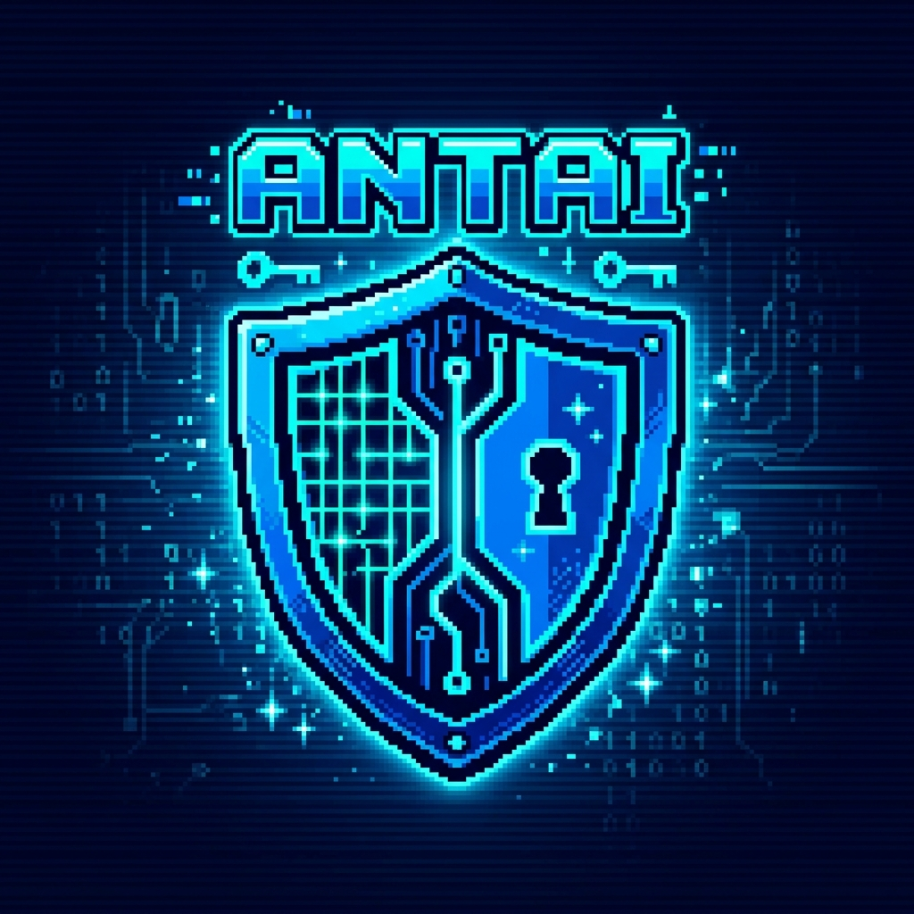

<div align="center">
  

  # 🛡️ ANTAI — Autonomous AI Cyber Defense Sentinel

  [](https://www.rust-lang.org/)
  [](LICENSE)
  [](#)
  [](#)
</div>

<br>

**ANTAI** is an open-source, native Rust autonomous cyber-defense sentinel engineered to intercept, analyze, and neutralize AI-driven exploits (Prompt Injections, Jailbreak, RAG Context Poisoning, Agentic Tool Execution Hijacking, and System File LFI) at **< 0.05µs latency** with **$0 API cost**.

```
┌─────────────────────────────────────────────────────────────────────────────┐
│                       ANTAI ARCHITECTURE TOPOLOGY                           │
├─────────────────────────────────────────────────────────────────────────────┤
│  Client App / Browser / Web App (Lovable / Bolt / Next.js / React)         │
│                        │                                                    │
│                        ▼ (HTTP Intercept Request)                           │
│  ┌───────────────────────────────────────────────────────────────────────┐  │
│  │ ⚡ ANTAI RUST CORE ENGINE (Port 8090 Proxy / Port 8091 REST Bridge)  │  │
│  ├───────────────────────────────────────────────────────────────────────┤  │
│  │  [Phase 1] Heuristic OWASP 36-Signature Sanitizer (< 0.05µs)        │  │
│  │  [Phase 2] System RAM & Active Process Scanner (sysinfo audit)        │  │
│  │  [Phase 3] Asymmetric Cross-Model AI Driver (Ollama/Groq/OpenRouter) │  │
│  └───────────────────────────────────────────────────────────────────────┘  │
│                        │                                                    │
│        ┌───────────────┴───────────────┐                                    │
│        ▼                               ▼                                    │
│ 🛑 403 Forbidden (Blocked)      ✅ 200 OK Clean (Passthrough)                │
└─────────────────────────────────────────────────────────────────────────────┘
```

---

## ⚡ Core Features

- **🦀 Pure Native Rust Core:** Zero garbage collector overhead, zero memory leaks, compiled for maximum throughput and memory safety.
- **⚡ Microsecond OWASP LLM 36-Signature Sanitizer ($0 Cost):** Precompiled C/Rust native regex engine blocking direct/indirect prompt injection, DAN mode jailbreaks, RAG poisoning, and obfuscated payloads in `< 0.05µs`.
- **🤖 Asymmetric Multi-Provider Defense Fallback:**
  1. *Ollama Local ($0 / Free)* — Zero data leakage, $0 API costs.
  2. *Groq Free Tier* — Ultra-fast Llama 3.3 70B validation.
  3. *OpenRouter Integration* — DeepSeek-R1 / Claude / GPT cross-model evaluation.
- **🔍 System & Process Audit Engine:** Audits active processes, system RAM/CPU load, and flags malicious hacktools/miners (`xmrig`, `mimikatz`, `netcat`, `chisel`, `ngrok`).
- **🌐 Universal Web SDK (Lovable, Bolt.new, React, Next.js, Vercel):** Single-line client integration with `protectFetch()` and zero-downtime `failOpen` mode.
- **🎨 Imperial Fluid UI (100vh Single Viewport):** Container-less design adhering to Imperial Crimson (`#ff003c`) aesthetics with real-time attack topology canvas graphs.

---

## 🚀 Quick Start (Windows / Linux / macOS)

### 1. Clone & Build

```bash
# Clone repository
git clone https://github.com/your-username/ANTAI.git
cd ANTAI

# Build native release binary
cd antai-core
cargo build --release
```

### 2. Run ANTAI Sentinel

Double click **`start_antai.bat`** (Windows) or execute:

```bash
# Start Native Engine & Control Room UI
./target/release/antai-core
```

Open `index.html` in your web browser to view the **Imperial Control Room**.

---

## 🔌 Developer Integration (Browser & Edge Middleware)

### Client-Side (Lovable / Bolt.new / React / HTML)

Include `sdk/antai-sdk.js` in your project:

```html
<script src="sdk/antai-sdk.js"></script>
<script>
  const sentinel = new Antai({ failOpen: true });
  sentinel.protectFetch(); // Automatically intercepts all outgoing prompt payloads
</script>
```

### Next.js / Vercel Edge Middleware

In your `middleware.ts`:

```typescript
import { antaiNextMiddleware } from './sdk/antai-middleware';

export default antaiNextMiddleware;

export const config = {
  matcher: '/api/:path*',
};
```

---

## 🛡️ OWASP LLM Top 10 Threat Coverage

| OWASP Vector | Threat Category | ANTAI Mitigation |
| :--- | :--- | :--- |
| **LLM01** | Direct & Indirect Prompt Injection | Microsecond RegexSet Match + Cross-Model Verdict |
| **LLM02** | Sensitive Information Disclosure / SSRF | AWS/GCP Cloud Metadata & Local File Inclusion Sanitizer |
| **LLM06** | Excessive Agency / Credential Theft | DB Dump & Secret Exposure Pattern Block |
| **LLM07** | Insecure Plugin / RAG Context Poisoning | Hidden Directive & HTML Comment Strip Filter |
| **LLM08** | Agentic Command & Tool Hijacking | OS Subprocess & Command Execution Piping Intercept |

---

## 📄 License

Distributed under the **MIT License** — Free and open-source for everyone.
